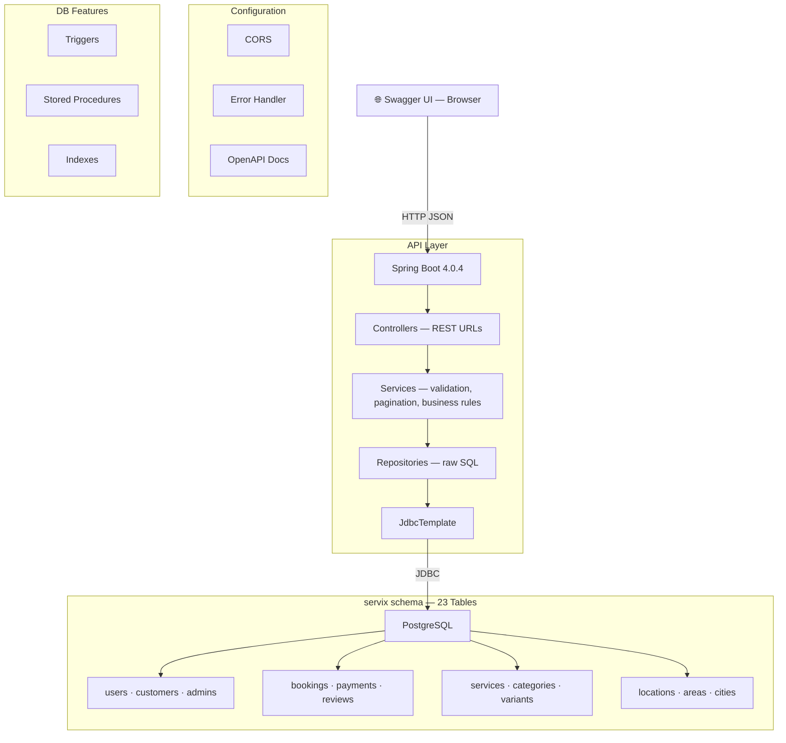

<div align="center">

# ⬡ Servix — Service Marketplace API

**A production-grade REST API built on a BCNF-normalized 23-table PostgreSQL schema**

[](https://spring.io/projects/spring-boot)
[](https://www.postgresql.org/)
[](https://adoptium.net/)
[](#quick-start)

[Architecture](#️-architecture) · [Database Design](#️-database-design) · [API Endpoints](#-api-endpoints) · [Quick Start](#-quick-start)

</div>

---

## 📋 Overview

**Servix** is a hyperlocal home-services marketplace (similar to Urban Company) where customers can discover, book, and review service providers for tasks like electrical work, plumbing, cleaning, and painting.

This project focuses on **database engineering excellence** — featuring a rigorously normalized schema, advanced SQL analytics, and a layered REST API that exposes the full power of PostgreSQL.

### Highlights

- 🏗️ **23-table BCNF-normalized schema** with mathematical proof of compliance
- 🧱 **Controller → Service → Repository** layering, with pagination and input validation centralized in the service layer
- 📊 **21 REST endpoints** with pagination, showcasing advanced SQL (Window Functions, Derived Tables, STRING_AGG)
- ⚡ **Stored Procedures** for transactional operations (booking cancellation/confirmation)
- 🔄 **Database Triggers** for automatic rating recalculation on review INSERT/UPDATE/DELETE
- 📦 **Materialized Views** for O(1) pre-computed analytics (leaderboard, city revenue)
- 📖 **Interactive Swagger UI** for live API exploration

---

## 🏛️ Architecture



> The API layer is intentionally split into three tiers: **controllers** stay thin and only handle HTTP concerns, **services** own request validation and pagination math (`page`/`limit` → `limit`/`offset`), and **repositories** stay focused purely on SQL access via `JdbcTemplate`.

---

## 🗄️ Database Design

### Entity-Relationship Summary

| Domain | Tables | Description |
|:-------|:------:|:------------|
| **Auth** | 3 | `users`, `customers`, `admins` — ISA hierarchy with role-based access |
| **Providers** | 4 | `service_providers`, `provider_documents`, `provider_availability`, `provider_services` |
| **Services** | 3 | `categories`, `services`, `service_variants` — hierarchical catalog |
| **Location** | 4 | `cities`, `areas`, `locations`, `customer_addresses` — BCNF-compliant geo data |
| **Bookings** | 4 | `bookings`, `booking_items`, `booking_status_log`, `coupons` |
| **Payments** | 2 | `payments`, `cancellations` — 1:1 with bookings |
| **Reviews** | 3 | `provider_reviews`, `service_reviews`, `complaints` |

### BCNF Compliance

The schema underwent a targeted normalization refactor to resolve a hidden dependency:

```
BEFORE (violated BCNF):
  addresses(address_id, customer_id, area_id, street, landmark, label, latitude, longitude)
  FD: {latitude, longitude} → {area_id, street, landmark}  ← NOT a superkey!

AFTER (BCNF compliant):
  locations(location_id, area_id, street, landmark, latitude, longitude)
    → {latitude, longitude} is now a UNIQUE candidate key ✅
  customer_addresses(customer_id, location_id, label)
    → Pure junction table, all-key ✅
```

📄 Full mathematical proof: [`SERVIX_Normalization_Proof.md`](docs/SERVIX_Normalization_Proof.md)

📊 Entity-Relationship Diagram: [`FINAL_SCHEMA.pdf`](docs/FINAL_SCHEMA.pdf)

📝 Top 15 SQL Queries: [`servix_queries.sql`](sql/servix_queries.sql)

⚡ Query Optimization Report: [`QUERY_OPTIMIZATION.md`](docs/QUERY_OPTIMIZATION.md)

---

## 🔌 API Endpoints

### 1. General — Browse & Search (Paginated)
| Method | Endpoint | SQL Technique |
|:-------|:---------|:-------------|
| `GET` | `/api/general/services?page=1&limit=10` | JOIN, ORDER BY, LIMIT/OFFSET |
| `GET` | `/api/general/services/search?q={keyword}&page=1&limit=10` | 5-table JOIN, ILIKE, LIMIT/OFFSET |
| `GET` | `/api/general/providers/top?top=5` | JOIN, configurable LIMIT, NULLS LAST |
| `GET` | `/api/general/providers/available?day={day}&page=1&limit=10` | Parameterized JOIN, LIMIT/OFFSET |

### 2. Customer — Bookings & Addresses (Paginated)
| Method | Endpoint | SQL Technique |
|:-------|:---------|:-------------|
| `GET` | `/api/customers/{id}/bookings?page=1&limit=10` | 3-table JOIN, LIMIT/OFFSET |
| `GET` | `/api/customers/{id}/bookings/{bid}/items` | LEFT JOIN, computed columns |
| `GET` | `/api/customers/{id}/payments?page=1&limit=10` | JOIN, NULLS LAST, LIMIT/OFFSET |
| `GET` | `/api/customers/{id}/spending` | CASE, SUM, COUNT, GROUP BY |
| `GET` | `/api/customers/{id}/addresses` | **4-table JOIN** (BCNF path) |

### 3. Provider — Jobs & Analytics (Paginated)
| Method | Endpoint | SQL Technique |
|:-------|:---------|:-------------|
| `GET` | `/api/providers/{id}/pending?page=1&limit=10` | 3-table JOIN via locations, LIMIT/OFFSET |
| `GET` | `/api/providers/{id}/completed?page=1&limit=10` | LEFT JOIN, LIMIT/OFFSET |
| `GET` | `/api/providers/{id}/earnings` | SUM, COUNT, GROUP BY |
| `GET` | `/api/providers/{id}/reviews?page=1&limit=10` | 3-table JOIN via bookings, LIMIT/OFFSET |
| `GET` | `/api/providers/{id}/rating` | **Derived Table (Subquery in FROM)** |

### 4. Admin — Analytics Dashboard
| Method | Endpoint | SQL Technique |
|:-------|:---------|:-------------|
| `GET` | `/api/admin/revenue` | 5-table JOIN, SUM, GROUP BY |
| `GET` | `/api/admin/leaderboard?fast=true` | **RANK() Window Function** / **Materialized View** |
| `GET` | `/api/admin/complaints` | **STRING_AGG**, 5-table JOIN |
| `GET` | `/api/admin/city-revenue` | **Materialized View** (pre-computed 5-table JOIN) |
| `POST` | `/api/admin/refresh-views` | Refreshes both Materialized Views |

### 5. Booking Actions — Stored Procedures
| Method | Endpoint | SQL Technique |
|:-------|:---------|:-------------|
| `POST` | `/api/bookings/{id}/cancel` | **Stored Procedure** (sp_cancel_booking) |
| `POST` | `/api/bookings/{id}/confirm` | **Stored Procedure** (sp_confirm_booking) |

### 6. Health Check
| Method | Endpoint | Description |
|:-------|:---------|:------------|
| `GET` | `/health` | Returns API status, DB connectivity, and version |

---

## 🚀 Quick Start

### Prerequisites
- Java 21+
- PostgreSQL 16+
- Maven 3.9+

### Local Development

```bash
# 1. Clone the repo
git clone https://github.com/KrIsH-1206/servix-api.git
cd servix-api

# 2. Configure environment
cp .env.example .env
# Edit .env and set your PostgreSQL password

# 3. Set up database
psql -U postgres -c "CREATE DATABASE servix_db"
psql -U postgres -d servix_db -f sql/servix_ddl.sql
psql -U postgres -d servix_db -f sql/servix_data.sql

# 4. Run the API
export DB_PASSWORD=your_password   # Linux/Mac
$env:DB_PASSWORD="your_password"   # Windows PowerShell
mvn spring-boot:run

# 5. Open Swagger UI
open http://localhost:8080/swagger-ui.html
```

### Docker (One Command)

```bash
docker-compose up --build
# API:     http://localhost:8080/swagger-ui.html
# Health:  http://localhost:8080/health
```

---

## 🛠️ Tech Stack

| Layer | Technology | Purpose |
|:------|:-----------|:--------|
| Runtime | Java 21 (Temurin) | Long-term support JDK |
| Framework | Spring Boot 4.0.4 | REST API + dependency injection |
| Database | PostgreSQL | Relational database |
| DB Access | Spring JDBC (JdbcTemplate) | Raw SQL execution — intentionally chosen over JPA to showcase SQL proficiency |
| API Docs | springdoc-openapi 3.0.2 | Auto-generated Swagger UI |
| Container | Docker + Docker Compose | Reproducible deployments |

---

## 📁 Project Structure

```
servix-api/
├── src/main/java/com/servix/api/
│   ├── ServixApiApplication.java         # Entry point
│   ├── config/
│   │   ├── OpenApiConfig.java            # Swagger metadata
│   │   ├── CorsConfig.java              # Cross-origin config
│   │   └── GlobalExceptionHandler.java   # JSON error responses
│   ├── controller/
│   │   ├── GeneralController.java        # 4 browse/search endpoints
│   │   ├── CustomerController.java       # 5 customer endpoints
│   │   ├── ProviderController.java       # 5 provider endpoints
│   │   ├── AdminController.java          # 3 analytics endpoints
│   │   ├── BookingActionController.java  # 2 stored procedure endpoints
│   │   └── HealthController.java         # /health check
│   ├── service/
│   │   ├── GeneralService.java           # Browse/search validation + pagination
│   │   ├── CustomerService.java          # Customer-facing business rules
│   │   ├── ProviderService.java          # Provider-facing business rules
│   │   ├── AdminService.java             # Admin dashboard orchestration
│   │   ├── BookingActionService.java     # Booking action validation
│   │   └── Pagination.java               # Shared page/limit → limit/offset helper
│   └── repository/
│       ├── GeneralRepository.java        # Browse & search queries
│       ├── CustomerRepository.java       # Customer data queries
│       ├── ProviderRepository.java       # Provider analytics queries
│       ├── AdminRepository.java          # Admin dashboard queries
│       └── BookingActionRepository.java  # Stored procedure calls
├── src/main/resources/
│   ├── application.properties            # Dev config
│   └── application-prod.properties       # Production config
├── sql/
│   ├── servix_ddl.sql                     # Schema (23 tables)
│   └── servix_data.sql                    # Seed data
├── Dockerfile                            # Multi-stage build
├── docker-compose.yml                    # Full-stack local setup
└── pom.xml                               # Dependencies
```

---

## 📊 Advanced SQL Showcase

This project intentionally uses **Spring JDBC** instead of JPA/Hibernate to demonstrate advanced SQL capabilities:

<details>
<summary><b>Window Function — Provider Leaderboard</b></summary>

```sql
SELECT
    RANK() OVER (ORDER BY sp.avg_rating DESC NULLS LAST,
                 COUNT(b.booking_id) DESC)   AS rank,
    sp.provider_id, u.email, ci.city_name,
    sp.avg_rating,
    COUNT(b.booking_id)                      AS jobs_completed,
    COALESCE(SUM(b.total_amount), 0)         AS total_revenue
FROM service_providers sp
JOIN users u ON sp.user_id = u.user_id
JOIN cities ci ON sp.city_id = ci.city_id
LEFT JOIN bookings b ON sp.provider_id = b.provider_id
                    AND b.status = 'completed'
WHERE sp.is_active = TRUE
GROUP BY sp.provider_id, u.email, ci.city_name, sp.avg_rating
ORDER BY rank
```
</details>

<details>
<summary><b>Derived Table — Rating vs City Average</b></summary>

```sql
SELECT sp.provider_id, u.email, ci.city_name,
       sp.avg_rating AS my_rating,
       city_avg.avg_city_rating,
       CASE
           WHEN sp.avg_rating > city_avg.avg_city_rating THEN 'Above Average'
           WHEN sp.avg_rating = city_avg.avg_city_rating THEN 'Average'
           ELSE 'Below Average'
       END AS comparison
FROM service_providers sp
JOIN users u ON sp.user_id = u.user_id
JOIN cities ci ON sp.city_id = ci.city_id
JOIN (
    SELECT city_id, ROUND(AVG(avg_rating), 2) AS avg_city_rating
    FROM service_providers WHERE avg_rating IS NOT NULL
    GROUP BY city_id
) city_avg ON sp.city_id = city_avg.city_id
WHERE sp.provider_id = ?
```
</details>

<details>
<summary><b>Stored Procedure — Booking Cancellation</b></summary>

```sql
CALL sp_cancel_booking(booking_id, 'Customer changed mind');
-- Atomically: updates status, creates cancellation record,
-- processes refund if payment exists — all in one transaction
```
</details>

---

## 📡 Sample Response

`GET /api/admin/leaderboard` — uses `RANK()` Window Function:

```json
[
  {
    "rank": 1,
    "provider_id": 1,
    "email": "ravi.electrician@gmail.com",
    "city_name": "Ahmedabad",
    "avg_rating": 5.00,
    "jobs_completed": 1,
    "total_revenue": 180.00
  },
  {
    "rank": 3,
    "provider_id": 5,
    "email": "karan.carpenter@gmail.com",
    "city_name": "Delhi",
    "avg_rating": 4.80,
    "jobs_completed": 0,
    "total_revenue": 0
  }
]
```
---

<div align="center">

**Made by [KrIsH-1206](https://github.com/KrIsH-1206)** — If this was useful, drop a ⭐

</div>
